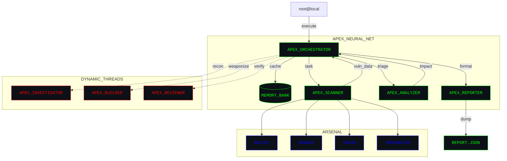

```text
 ▄▀█ █▀█ █▀▀ ▀▄▀
 █▀█ █▀▀ ██▄ █░█
```

# A P E X  // Advanced Web Application Security Scanner
### [Version: 2.1.0-alpha] // [Status: WEAPONIZED]

  

> "The difference between a bug and a breach is execution. Apex executes."

Apex is a highly weaponized, autonomous multi-agent security testing framework engineered for web applications and APIs. Leaving standard vulnerability scanners in the dust, Apex operates as a fully-fledged Bug Bounty Hunting (BBH) AI suite. By bridging heuristic payload injection with deep OWASP coverage and elite external integrations (Nuclei, Ghauri, Arjun), it simulates the mindset and workflow of an advanced red-teamer.

---

## ⚡ :: TACTICAL FEATURES

- **[+] Autonomous Agentic Workflow**: An elite Orchestrator dynamically plans, delegates, and executes complex attack chains.
- **[+] Next-Gen Attack Surface Mapping**:
  - **OWASP Top 10**: SQLi, XSS, SSRF, XXE, IDOR, Broken Access Control, Deserialization, and more.
  - **Modern Exploits**: HTTP Request Smuggling, Mass Assignment, SSTI, and Swagger/GraphQL Introspection.
- **[+] Polymorphic Payload Engine**: Context-aware fuzzing and DOM XSS validation via headless browsers.
- **[+] OAST Integration**: Blind vulnerability detection wired directly into `Interactsh`.
- **[+] AI Triage & Analysis**: No more noise. Apex filters false positives by cross-analyzing error signatures and verifying exploit chains before reporting.

---

## 🕸️ :: SYSTEM ARCHITECTURE

Apex uses a decentralized, multi-agent architecture communicating via a hyper-optimized "caveman" protocol for maximum efficiency.



---

## 🛠️ :: INSTALLATION & BOOTSTRAP

Bootstrapping the environment requires standard infosec prerequisites. 

```bash
# Clone the repository
git clone https://github.com/yourusername/apex.git
cd apex

# Install Python dependencies
pip install -r requirements.txt

# Install Playwright browser engines for DOM XSS
playwright install

# Initialize Hacker-Themed Setup/Installer
python installer.py
```

---

## 💻 :: MISSION CONTROL (USAGE)

Apex features a versatile CLI designed for both surgical strikes and wide-net reconnaissance. 

### `[>]` Basic Reconnaissance
```bash
python main.py https://target.com
```

### `[>]` The Bug Bounty "Autopilot" Mode
Unleash the full autonomous AI + external tools suite. This will aggressively map, fuzz, and exploit the target.
```bash
python main.py https://target.com --autopilot
```

### `[>]` Full Arsenal Deployment
Enable all available internal modules and external tools simultaneously.
```bash
python main.py https://target.com --all-modules --all-tools
```

### `[>]` Surgical API Hunt
Force-enable Swagger/OpenAPI discovery to hunt for exposed and undocumented endpoints.
```bash
python main.py https://api.target.com --api-hunt
```

### `[>]` Advanced Command Line Options
Mix and match flags for granular control over the execution flow:

| Flag | Description |
|------|-------------|
| `--autopilot` | Enable full autonomous AI & tool integration mode |
| `--all-modules` | Fire all internal vulnerability modules at the target |
| `--all-tools` | Fire all integrated external tools (Nuclei, Ghauri, etc.) |
| `--tools <list>` | Run specific tools (e.g., `--tools nuclei,arjun`) |
| `--modules <list>`| Restrict scan to specific modules (e.g., `--modules sql_injection,xxe`) |
| `--api-hunt` | Force-enable OpenAPI/Swagger discovery |
| `--depth <n>` | Set crawl depth for spidering (Default: 2) |
| `--rate-limit <n>`| Throttle requests to avoid WAF/ban (Default: 20) |
| `--caveman` | Enable raw, compressed agentic communication in terminal |
| `--insecure-tls` | Bypass TLS verification (Useful for labs and proxies) |
| `--verbose` | Output raw debug logs and HTTP interactions |

---

## 🔮 :: FUTURE ENHANCEMENTS (ROADMAP)

Apex is constantly evolving. The following capabilities are slated for upcoming updates:

- **[~] Zero-Day Module Generation**: Empowering the LLM `Builder` agent to automatically write custom Nuclei templates based on runtime observations.
- **[~] Continuous Integration**: Daemon mode to run persistent, scheduled bug bounty scans over time and alert on diffs.
- **[~] WAF Evasion Engine**: Advanced polymorphic payload encoding and chunked requests to silently bypass enterprise WAFs.
- **[~] Smart Fuzzing via GenAI**: Dynamic generation of fuzzing wordlists based on the target's business logic and DOM context.
- **[~] Graph-based Attack Paths**: Visualizing multi-step exploit chains (e.g., SSRF -> AWS Metadata -> Cloud Pivot) in the reporting UI.

---

> **WARNING**: This software is highly offensive. It is engineered strictly for authorized Red Teaming, Bug Bounty Hunting, and security assessments. Ensure explicit, written permission from the target before engaging. The developers are not liable for any unauthorized use.